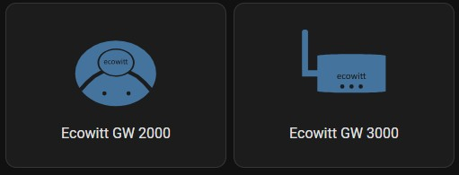
# ha-ecowitt-icons
Icons for the Ecowitt weather devices but can also be used by other Personal Weather Systems (PWS).
I have created these to go with the Ecowitt devices I own and and expose to Home Assistant using the Gateway's Custom Server generating MQTT-data. The MQTT-data is parsed using the files as available from the https://github.com/GH2user/ha_ecowitt_custom_mqtt repository. 

## <a name="installation"></a>Installation

### HACS:
Not Yet, please STAR this repository so it might get added to the default HACS repositories !


### Manual:
- Copy `dist/ha-ecowitt-icons.js` into your `config/www` folder.
- Go to Configuration -> Lovelace Dashboards -> Resources -> Add Resource
- set url as `/local/ha-ecowitt-icons.js` and Resource Type as `Javascript Module`.
- Add the following to your configuration.yaml, save and restart Home Assistant.
```
frontend:
  extra_module_url:
    - /local/ha-ecowitt-icons.js
```

- Save, restart Home Assistant.


## Usage
- In your entity editor, specify an icon as `ewi:TAG` 
- If you set `state_color: true` in your card, you'll see the icons get colorised based upon content (battery low, raining) for the binary-sensors.
- They will show up in the new icon-picker from HA 2021-11.0 and onwards

### Example:

```
title: Ecowitt
state_color: true
type: entities
entities:
  - entity: sensor.pwsecowitt_indoor_dewpoint
    icon: ewi:dewpoint
```

## Ecowitt Icons

ha-ecowitt-icons initially includes icons for the below mentioned Ecowitt devices.
Some of these have been hand drawn in Inkscape and others are reworked icons from the net.
- GW2000  gateway
- GW3000  gateway
- WS90    wittboy PWS
- WH40    rainfall collector
- WH57    lightning detector
- WH31    temp/hum sensor
- WH30    temp sensor

Besides specific icons for the devices I have modified the standard (mdi) weather icons to show;
- a difference between wind speed and wind gust
- a difference between absolute and relative pressure
- differences between rain collector being a funnel or piezo system
- differences for: dewpoint, heatindex, windchill temperatures
- time period for the rain icons
 
[//]: # (Start Ecowitt Icons)
## Version 1.0.0 added icons
I did not add a description to the icons as it's purpose should be clear. If you have any remarks/comments please leave them as an 'issue'.

2025-11-14  first release

### Gateway
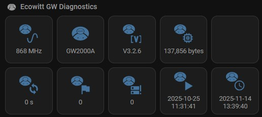
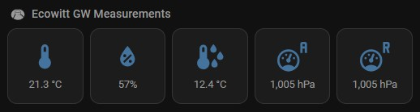

The smaller icons for the GW3000 are not yet made.

### WS90 Wittboy 7 in 1 PWS
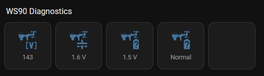
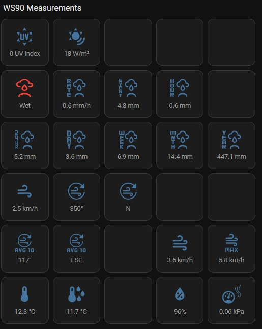
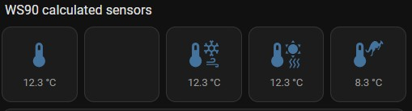


### WH30 + WH31 Temperature / Humidity sensors
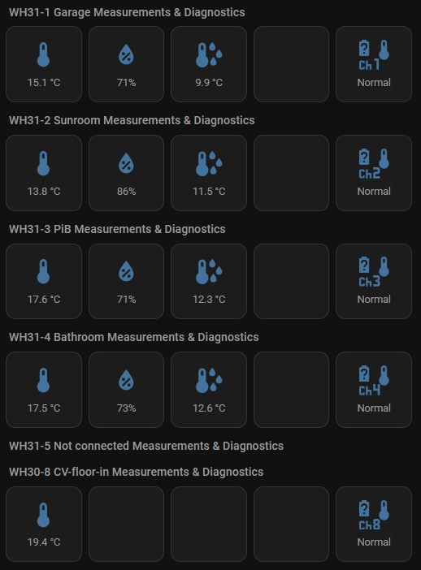


### WH40 Rainfall Collector
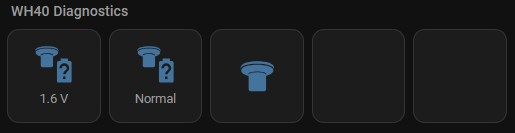
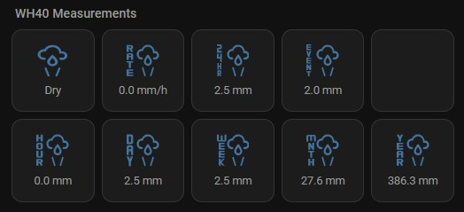

### WH57 Lightning Detector
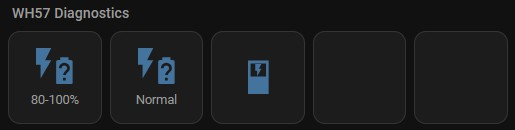
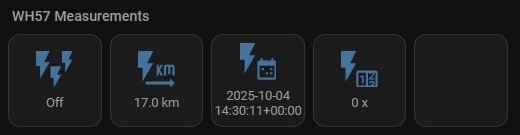


  
## Icon Requests?
You like another design or a specific icon? Let me know what's missing by raising a [Custom Icon Request](https://github.com/GH2user/ha-ecowitt-icons/issues/new?assignees=GH2user&labels=icon+request&template=custom-icon-request.md&title=Icon%20Request%20%5Bname%20of%20coin%5D).


## Discussion:
Currently there is no dedicated area to discuss this, if sufficient interest we can open one on the [home assistant forums](https://community.home-assistant.io/c/projects/9).


## Troubleshooting:

### Can't see the icons?
If you cannot see the new icons, or you get an empty box where you're expecting an icon, press CTRL-F5 when your browser window has focus. 

### Still can't see the icons?
If you cannot see the new icons, or you get an empty box where you're expecting an icon, flush your network cache. 

### Icons don't show on first load of the dash?
Did you add the frontend extra_module_url in your configuration.yaml? See the [installation section](#installation) for details.


 
## Thanks and 
- based on original work of @arallsopp for which many thanks
- Everyone who has helped extending this repo by raising an [Icon Request](https://github.com/GH2user/ha-ecowitt-icons/issues/new?assignees=GH2user&labels=icon+request&template=custom-icon-request.md&title=Icon%20Request%20%5Bname%20of%20coin%5D).

---


### License
I do this for fun, without charge, and to give back to the community. You may remix, tweak, and build upon this work non-commercially, as long as you credit the original author, provide a link to the license, and indicate if any changes were made. You may do so in any reasonable manner, but not in any way that suggests the licensor endorses you or your use unless agreed. If you remix, transform or build upon the material, you must distribute your contributions under the same or compatible license as the original. 
